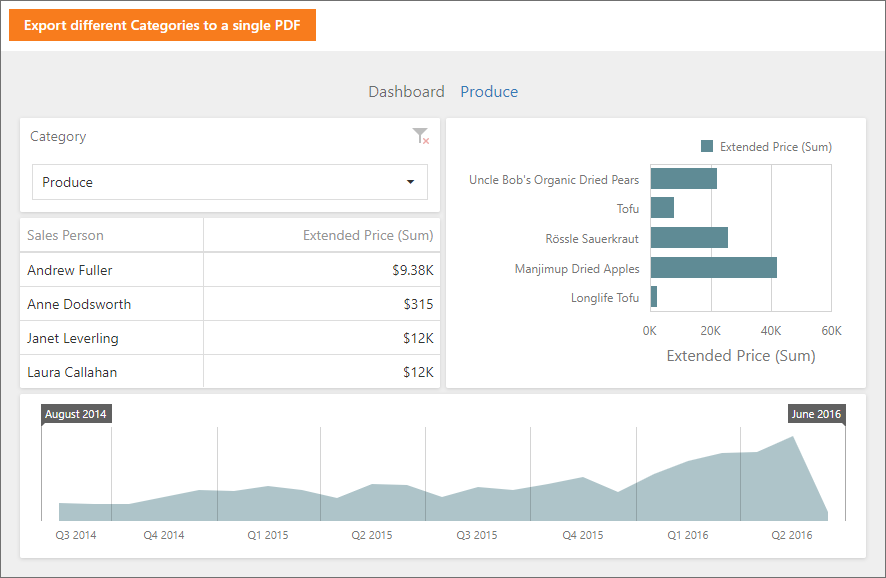

<!-- default badges list -->

<!-- default badges end -->

# Dashboard for Web Forms - How to export Web Dashboard into PDF with different filter values on different pages

<!-- run online -->
**[[Run Online]](https://codecentral.devexpress.com/128580211/)**
<!-- run online end -->

This example shows how to export a dashboard with different dashboard states (different master filter value) to separate pages and join them to a single PDF document.

The example is based on the [How to implement server-side export in the ASP.NET Dashboard Control](https://github.com/DevExpress-Examples/web-forms-dashboard-implement-server-side-export) example and uses the same [ASPxDashboardExporter](https://docs.devexpress.com/Dashboard/DevExpress.DashboardWeb.ASPxDashboardExporter?p=netframework) class to export a dashboard with different states to multiple documents on the server side. 

Then, multiple exported documents are joined in a single file with help of the [PdfDocumentProcessor](https://docs.devexpress.com/OfficeFileAPI/DevExpress.Pdf.PdfDocumentProcessor) class.

## Files to Review

* [Default.aspx](./CS/ASPxDashboard_ServerExport/Default.aspx) (VB: [Default.aspx](./VB/ASPxDashboard_ServerExport/Default.aspx))
* [Default.aspx.cs](./CS/ASPxDashboard_ServerExport/Default.aspx.cs) (VB: [Default.aspx.vb](./VB/ASPxDashboard_ServerExport/Default.aspx.vb))
* [script.js](./CS/ASPxDashboard_ServerExport/Script/script.js) (VB: [script.js](./VB/ASPxDashboard_ServerExport/Script/script.js)) 

## Documentation

- [Manage Exporting Capabilities in ASP.NET Web Forms](https://docs.devexpress.com/Dashboard/12140/web-dashboard/integrate-dashboard-component/aspnet-web-forms-dashboard-control/manage-exporting-capabilities?p=netframework)
- [ASPxDashboardExporter](https://docs.devexpress.com/Dashboard/DevExpress.DashboardWeb.ASPxDashboardExporter)
- [PdfDocumentProcessor](https://docs.devexpress.com/OfficeFileAPI/DevExpress.Pdf.PdfDocumentProcessor)

## More Examples

- [Dashboard for Web Forms - How to implement server-side export](https://github.com/DevExpress-Examples/web-forms-dashboard-implement-server-side-export)
